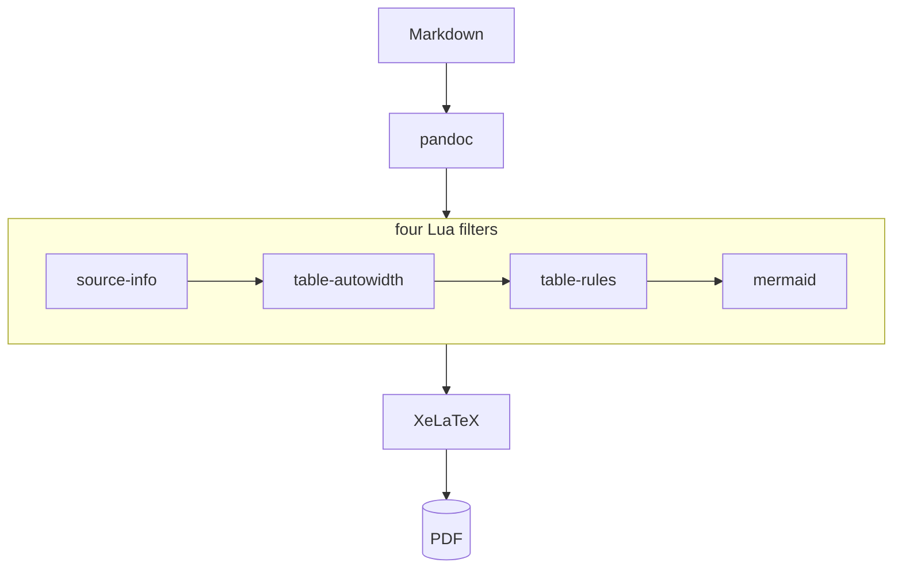
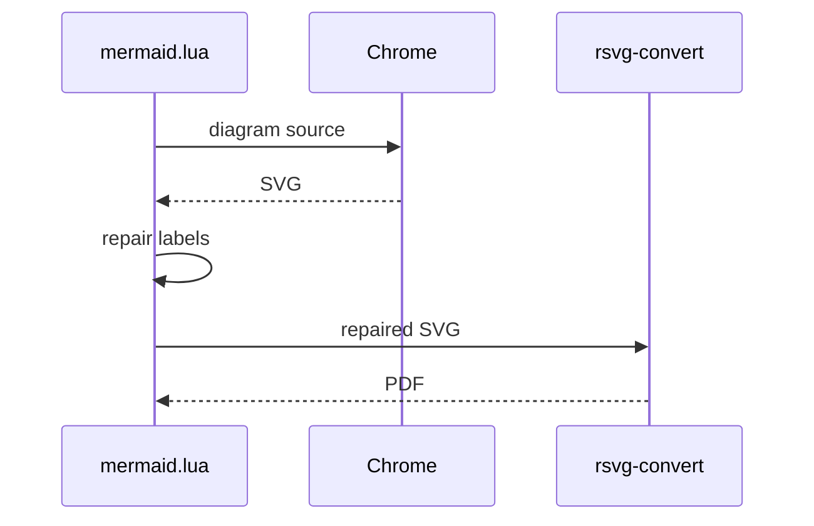
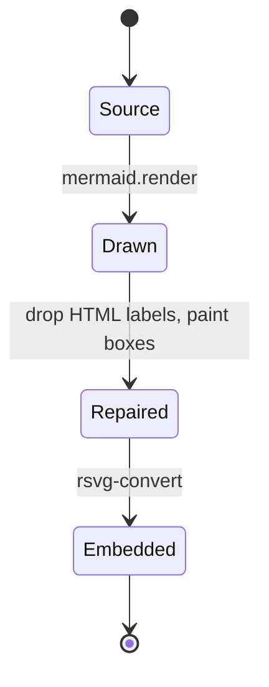

This document was produced by the theme it describes. Everything on these pages
came out of one command:

```sh
pandoc -d pandoc-pdf -d fonts-macos example/showcase.md -o showcase.pdf
```

The source is plain Markdown. No LaTeX was written to make the tables fit, to
rule the rows, or to draw the diagrams.

## The four filters

Four Lua filters run between pandoc reading the Markdown and XeLaTeX setting the
page. Three of them rewrite the document; the fourth only reads the file name.

| Filter | What it changes | Turn it off with |
|--------|-----------------|------------------|
| `source-info` | Sets the language from the file name, so an `index.de.md` is hyphenated as German, and puts the address the page will have into the footer | — |
| `table-autowidth` | Replaces pandoc's column widths, which come from the markdown source, with widths measured from the cells | `table-autowidth: false` |
| `table-rules` | Draws a hairline between rows, which booktabs leaves out and no package in a small TeX installation supplies | `table-row-rules: false` |
| `mermaid` | Draws mermaid blocks as diagrams instead of setting them as source code | `mermaid: false` |

Each is a separate file, and each can be switched off on its own.

## What happens to a document

A document passes through them in the order they are listed, and only then
reaches LaTeX.



## Tables

Pandoc takes column widths from the number of dashes in the separator row. The
table below was written with `|--|--|--|` throughout, which says nothing about
what the cells hold. The widths still come out right, because the filter
measures the cells instead of counting the dashes.

|Price|Mem Bandwidth|CPU|RAM|NVMe|Cores|GPU|Model|Price/Bandwidth|
|--|--|--|--|--|--|--|--|--|
|2.500 EUR|273 GB/s|M4 Pro|64 GB|1 TB|12C|16C|Mac Mini|9,15 EUR/GB/s|
|4.027 EUR|546 GB/s|M4 Max|128 GB|1 TB|16C|40C|Mac Studio|7,14 EUR/GB/s|
|4.200 EUR|800 GB/s|M3 Ultra|96 GB|1 TB|28C|60C|Mac Studio|5,52 EUR/GB/s|
|6.720 EUR|800 GB/s|M3 Ultra|256 GB|2 TB|28C|60C|Mac Studio|8,40 EUR/GB/s|

A table of sentences is divided differently, and the table of filters on the
first page is one. Columns that already fit are left alone, and what remains is
shared among the wide columns in proportion to how much text each holds, so the
rows come out about equally tall. A column of prose is never squeezed below a
readable width, however long the cell beside it is: without that rule, the
second column there would take most of the page and leave the third too narrow
to read.

The hairlines between the rows of both tables are the third filter at work. They
matter most where a row wraps onto two lines and nothing else shows which lines
belong together.

## Code

Code blocks are set one step below the body size. At the body size Menlo leaves
room for 73 characters; here 89 fit. The ruler below is 89 characters wide and
ends at the right margin.

```text
12345678901234567890123456789012345678901234567890123456789012345678901234567890123456789
```

```python
async def render(source: str, cache: Path) -> Path:
    key = hashlib.sha1(source.encode()).hexdigest()
    if not (pdf := cache / f"{key}.pdf").exists():
        await chrome_render(source, cache / f"{key}.svg")
    return pdf
```

## Diagrams

All 22 of mermaid's diagram types are drawn. There is no Node toolchain and no
mermaid-cli: headless Chrome draws the diagram with a copy of `mermaid.min.js`,
and `rsvg-convert` turns the result into a vector PDF.



Diagrams are cached by the hash of their source, so rebuilding a document costs
about two seconds for each block that changed and nothing for the rest.

The labels need repairing on the way out of the browser. Mermaid writes each one
twice, as HTML and as plain SVG text, and offers the pair to whatever draws the
file. The converter takes the HTML, cannot draw it, and never reaches the text,
so without the repair every shape comes out empty.



## What it is worth

Measured over 224 tables in a reference corpus, and over the code in a blog of
76 posts.

| Measure | Before | After |
|---------|--------|-------|
| Overfull boxes across 14 table-heavy documents | 1904 | 614 |
| Pages for the same 14 documents | 508 | 382 |
| Code lines that fit the page | 90% | 93% |
| Characters per line in a code block | 73 | 89 |

## Text

Strikeout works without the `soul` package, which a small TeX installation does
not ship: ~~this is struck out~~. Arrows and marks that many text faces lack are
taken from the other families: → ← ↑ ↓ ✓ ✗.

The footer of this page shows the file it was written to. For a page inside a
Hugo site it shows the address that page will have once published, worked out
from the site's `baseURL`, the language prefix, and the path below `content/`
with the last segment replaced by the front matter `slug`.
