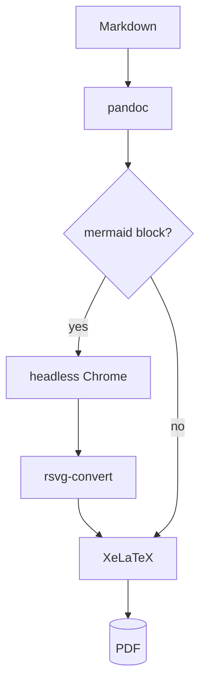

This file exercises the whole theme. Render it with:

```sh
pandoc -d pandoc-pdf example/showcase.md -o showcase.pdf
```

## Tables

Column widths come from what is in the cells, not from the dashes in the
markdown. The `|--|--|` below says nothing about content, and the widths still
come out right.

|Price|Mem Bandwidth|CPU|RAM|NVMe|Cores|GPU|Model|Price/Bandwidth|
|--|--|--|--|--|--|--|--|--|
|2.500 EUR|273 GB/s|M4 Pro|64 GB|1 TB|12C|16C|Mac Mini|9,15 EUR/GB/s|
|4.027 EUR|546 GB/s|M4 Max|128 GB|1 TB|16C|40C|Mac Studio|7,14 EUR/GB/s|
|4.200 EUR|800 GB/s|M3 Ultra|96 GB|1 TB|28C|60C|Mac Studio|5,52 EUR/GB/s|

A table of prose is split so that the rows come out about equally tall, and a
column of sentences is never squeezed below a readable width.

| Attack | How it works | Mitigation |
|--------|--------------|------------|
| Naming | Attackers register look-alike names so the model picks the wrong resource | Verify identities and use a trusted registry |
| Rug pull | A useful tool changes its behaviour once it is widely adopted | Monitor for behavioural change and gate versions |

## Code

Code blocks are set one step below the body size, which fits about 20% more
characters on a line.

```python
result = await client.messages.create(model=MODEL, max_tokens=1024, messages=msgs)
```

## Diagrams

A ```mermaid block is drawn into the page.



## Text

Strikeout works without the soul package: ~~this is struck out~~. Arrows and
marks that many text faces lack are taken from the other families: → ← ✓ ✗.
